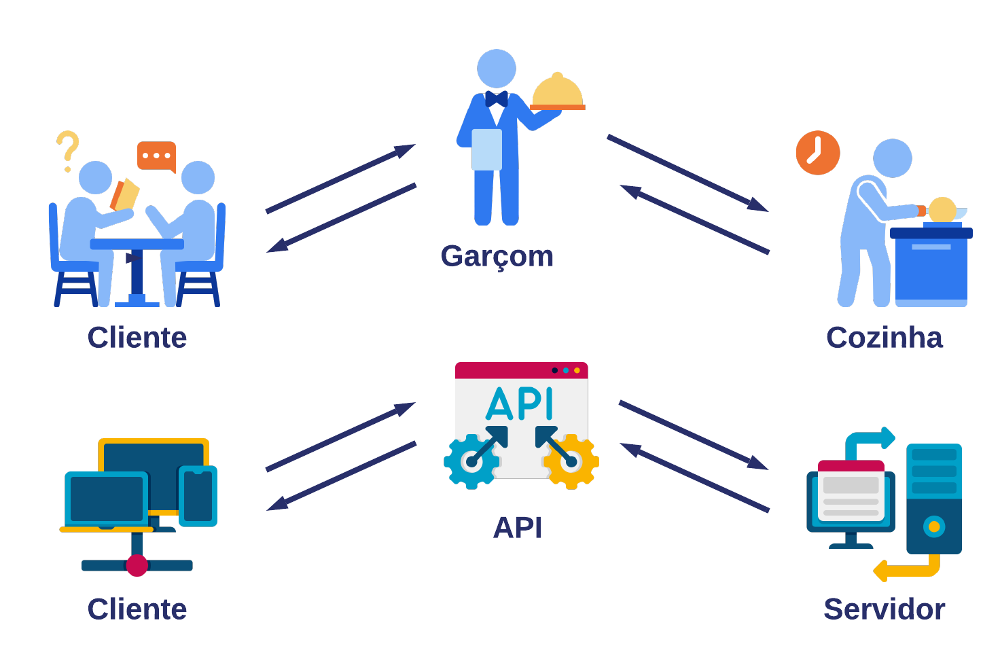

# Node.js: API Rest com Express e MongoDB

O termo API (Application Programming Interface ou, em português, Interface de Programação de Aplicações) é amplamente utilizado quando se trata de desenvolvimento de software. É muito importante que você conheça esses principais termos, entenda-os melhor, para que possa sempre estar antenado às melhorias e boas práticas que são utilizados na comunicação dos sistemas distribuídos.





### Tipos APIs

APIs Web


APIs de código fonte

```sh
node app

const data = new Date();
const month = data.getMonth() + 1;

```


### Padrões de API Web

RPC (Remote Procedure Call)
Soap
REST (Representational State Transfer)


## O que são exatamente estes gerenciadores?

Gerenciadores de pacotes são repositórios de código aberto nos quais devs disponibilizam soluções para o uso da comunidade. Estas soluções nada mais são do que programas que outras pessoas desenvolveram e que utilizamos para ganhar tempo no desenvolvimento de nosso próprio código, e vão desde libs (bibliotecas pequenas e específicas) até frameworks com vários recursos prontos. E um pacote (ou módulo) - aqui podemos pensar em um pacote mesmo - que é como chamamos o conjunto do código que determinada lib ou framework utiliza para executar.

Algumas dessas bibliotecas são desenvolvidas por times para resolver algum problema específico que tiveram que enfrentar. Depois, elas são disponibilizadas para que outras pessoas com o mesmo contratempo aproveitem e também utilizem. Outras bibliotecas são disponibilizadas por empresas de software, que utilizam as plataformas dos gerenciadores, para a distribuição de suas soluções de código. E sendo de código aberto, isso significa que você também pode criar e publicar a sua lib para outras pessoas baixarem e instalarem em seus projetos.


| Comando | Atalho | Uso |
| ------ | ------ | ------ |
| install | i | Instala um novo módulo |
| list | ls | Lista os módulos instalados |
| test | t | Executa o script de teste especificado no package.json |
| --global | -g | Usado como um sinalizador para instalar um pacote globalmente (não só na pasta do projeto)|
| --save | -S | Salva o módulo ao instalar |
| --save-exact | -E | Salva o módulo ao instalar, porém na versão exata mencionada |
| --save-dev | -D | Salva o módulo ao instalar, porém como uma dependência de desenvolvimento |
| npm home | - | Abre a página do projeto |
| npm repo | - | Abre o repositório de código do projeto |
| npm audit | - | Executa uma auditoria no projeto para identificar se existe alguma dependência com vulnerabilidade conhecida |
| npm update | - | Atualiza projetos para a última versão respeitando o package.json |
| npm outdated | - | Retorna a lista de dependências desatualizadas mostrando a versão mais recente |
| npm adduser | - | Adiciona um novo usuario no [https://registry.npmjs.org] para permitir a publicação de pacotes |
| npm publish | - | Faz a publicação do pacote no NPM |

Comando para obter informções

```sh

npm help <nome do comando>

```

#### Nessa aula, você aprendeu:

- Como o backend entrega os dados para o frontend;
- O que é uma API REST, que é uma interface que vai fornecer dados e recursos baseados em requisições e respostas HTTP;
- Iniciar um novo projeto Node através do comando npm init;
- Personalizar o arquivo de configuração package.json com scripts e as informações individualizadas do projeto;
- Utilizar um gerenciador de pacotes, como o NPM, para instalar novos módulos que serão utilizados no projeto;
- Como está estruturada a pasta node_modules e a importância de incluí-la no arquivo .gitignore;
- Construir um servidor local utilizando o módulo http do Node.js;
- Realizar a criação de novas rotas e qual o objetivo das mesmas;
- Instalação e utilização do nodemon para não ter que reiniciar o servidor a cada alteração.